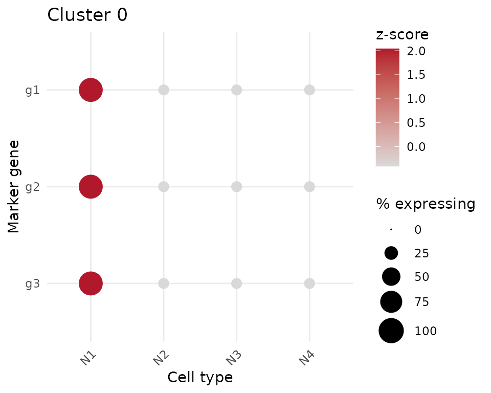

# Introduction to cengenAnnotate

``` r

library(cengenAnnotate)
library(dplyr)
#> 
#> Attaching package: 'dplyr'
#> The following objects are masked from 'package:stats':
#> 
#>     filter, lag
#> The following objects are masked from 'package:base':
#> 
#>     intersect, setdiff, setequal, union
```

## The workflow this package automates

Manually annotating clusters in a new C. elegans single-cell dataset
usually means: run
[`Seurat::FindAllMarkers()`](https://satijalab.org/seurat/reference/FindAllMarkers.html),
copy the top ~20 marker genes for a cluster, paste them into the CeNGEN
website, and visually judge whether the resulting dot plot shows one
cell type standing out. `cengenAnnotate` computes that judgment directly
from CeNGEN’s reference expression data, so most clusters can be
annotated automatically and only the genuinely ambiguous ones come back
for manual review.

This vignette builds a small **synthetic** reference dataset so it runs
offline and reproducibly. In real use, you’ll fetch reference data from
the CeNGEN pins board with \[list_cengen_datasets()\] and
\[load_cengen_reference()\] instead — see the last section.

## 1. A CeNGEN reference object

A reference is a long table of `gene`, `cell_type`, `avg_expr`
(unthresholded average expression) and `pct_expr` (percent of cells of
that type expressing the gene) — the same two quantities a CeNGEN dot
plot encodes as color and size.

``` r

set.seed(1)
cell_types <- paste0("N", 1:6)

make_gene <- function(gene, specific_to, base = 0, high = 8, cov_high = 90, cov_low = 15) {
  tibble(
    gene = gene,
    cell_type = cell_types,
    avg_expr = ifelse(cell_types == specific_to, high, base),
    pct_expr = ifelse(cell_types == specific_to, cov_high, cov_low)
  )
}

reference_data <- bind_rows(
  make_gene("g1", "N1"), make_gene("g2", "N1"), make_gene("g3", "N1"),
  make_gene("g4", "N2"), make_gene("g5", "N2"),
  make_gene("g6", "N3"), make_gene("g7", "N3"), make_gene("g8", "N3")
)

reference <- new_cengen_reference(
  reference_data,
  meta = list(stage = "demo", sex = "demo", dataset_label = "synthetic demo reference")
)
reference
#> <cengen_reference>
#>   stage:   demo
#>   sex:     demo
#>   label:   synthetic demo reference
#>   prepared: ?
#>   genes: 8, cell types: 6
```

## 2. Marker genes from Seurat

[`prepare_marker_panel()`](https://cengenproject.github.io/cengenAnnotate/reference/prepare_marker_panel.md)
takes raw
[`Seurat::FindAllMarkers()`](https://satijalab.org/seurat/reference/FindAllMarkers.html)
output and reduces it to the top marker genes per cluster (default 20;
equally weighted, fold-change is only used to pick which genes make the
panel).

``` r

markers <- tibble(
  cluster = c(rep("0", 3), rep("1", 2), rep("2", 1)),
  gene = c("g1", "g2", "g3", "g4", "g5", "g6"),
  avg_log2FC = c(2.1, 1.8, 1.5, 1.9, 1.2, 1.0),
  p_val_adj = c(0.001, 0.001, 0.001, 0.001, 0.001, 0.001)
)

# cluster "0": three genes specific to N1 -> should be a clear match
# cluster "1": two genes specific to N2 -> also a clear match, fewer genes
# cluster "2": one gene, and we'll require at least 2 usable genes below,
#   so it will be sent to review as marker-poor

prepare_marker_panel(markers, top_n = 20)
#> # A tibble: 6 × 5
#>   cluster gene   rank n_requested n_used
#>   <chr>   <chr> <int>       <dbl>  <dbl>
#> 1 0       g1        1          20      3
#> 2 0       g2        2          20      3
#> 3 0       g3        3          20      3
#> 4 1       g4        1          20      2
#> 5 1       g5        2          20      2
#> 6 2       g6        1          20      1
```

## 3. Scoring and classification

[`score_cengen_clusters()`](https://cengenproject.github.io/cengenAnnotate/reference/score_cengen_clusters.md)
scores every cluster against every candidate cell type and classifies
each as `"annotate"` or in need of review.

``` r

result <- score_cengen_clusters(
  markers, reference,
  min_genes_used = 2 # demo data only has a few genes per cluster
)
result
#> # A tibble: 3 × 11
#>   cluster best_cell_type best_score second_cell_type second_score   gap
#>   <chr>   <chr>               <dbl> <chr>                   <dbl> <dbl>
#> 1 0       N1                  0.892 N2                      0.245 0.648
#> 2 1       N2                  0.892 N1                      0.245 0.648
#> 3 2       N3                  0.892 N1                      0.245 0.648
#> # ℹ 5 more variables: n_genes_used <int>, n_genes_requested <dbl>,
#> #   n_genes_missing_from_reference <int>, n_genes_uninformative <int>,
#> #   decision <chr>
```

`"annotate"` clusters have one cell type that’s both well-covered and
specific across the marker panel; clusters below the score/gap cutoffs,
or with too few usable marker genes, come back as `"review_ambiguous"` /
`"review_insufficient_markers"` for manual follow-up instead.

The full cluster x cell-type matrix (not just the top 2 candidates) is
attached to the result:

``` r

cengen_matrix(result) |> filter(cluster == "0") |> arrange(desc(score))
#> # A tibble: 6 × 7
#>   cluster cell_type score n_genes_used n_genes_requested n_genes_missing_from_…¹
#>   <chr>   <chr>     <dbl>        <int>             <dbl>                   <int>
#> 1 0       N1        0.892            3                 3                       0
#> 2 0       N2        0.245            3                 3                       0
#> 3 0       N3        0.245            3                 3                       0
#> 4 0       N4        0.245            3                 3                       0
#> 5 0       N5        0.245            3                 3                       0
#> 6 0       N6        0.245            3                 3                       0
#> # ℹ abbreviated name: ¹​n_genes_missing_from_reference
#> # ℹ 1 more variable: n_genes_uninformative <int>
```

## 4. Writing annotations back onto a Seurat object

[`write_cengen_annotations()`](https://cengenproject.github.io/cengenAnnotate/reference/write_cengen_annotations.md)
is an explicit, opt-in step — clusters sent to review are never silently
annotated.

``` r

counts <- matrix(
  rpois(6 * 30, lambda = 3),
  nrow = 6, ncol = 30,
  dimnames = list(paste0("g", 1:6), paste0("cell", 1:30))
)
obj <- SeuratObject::CreateSeuratObject(counts = counts, min.cells = 0, min.features = 0)
#> Warning: Data is of class matrix. Coercing to dgCMatrix.
obj$seurat_clusters <- factor(rep(c("0", "1", "2"), each = 10))

obj <- write_cengen_annotations(obj, result)
table(obj$cengen_annotation, useNA = "ifany")
#> 
#>   N1   N2 <NA> 
#>   10   10   10
```

## 5. QC dot plot

For a visual sanity check (especially useful on `"review_ambiguous"`
clusters),
[`plot_cengen_dotplot()`](https://cengenproject.github.io/cengenAnnotate/reference/plot_cengen_dotplot.md)
reproduces the CeNGEN-style view for one cluster’s marker panel using
the same size/color signals the score is built from:

``` r

plot_cengen_dotplot(reference, markers, cluster = "0", scores = result, top_n_cell_types = 4)
```



## 6. Using real CeNGEN reference data

In real use, discover and load a real dataset from the CeNGEN pins board
instead of building a synthetic one (requires network access):

``` r

list_cengen_datasets()
#> # A tibble: 4 x 10
#>   name       stage sex           dataset_label                 ...
#>   <chr>      <chr> <chr>         <chr>                         ...
#> 1 adult_herm adult hermaphrodite adult hermaphrodite (CeNGEN)  ...
#> ...

reference <- load_cengen_reference("adult_herm")
result <- score_cengen_clusters(markers, reference)
```

## A note on the default cutoffs

The default `cutoff = 0.6` and `min_gap = 0.10` are provisional starting
points, not empirically derived thresholds. Before relying on
[`score_cengen_clusters()`](https://cengenproject.github.io/cengenAnnotate/reference/score_cengen_clusters.md)
for unattended annotation, calibrate them against clusters with
independently known identity and adjust as needed.
